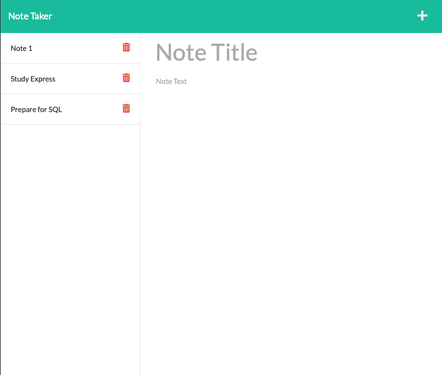

# NoteTaker_HW11
This application, Note Taker, uses an Express.js back end to save and retrieve note data from a JSON file. <br>
Currently deployed on heroku at: https://note-taker-hk.herokuapp.com <br>

## User Story

```
AS A small business owner
I WANT to be able to write and save notes
SO THAT I can organize my thoughts and keep track of tasks I need to complete
```

## Acceptance Criteria

```
GIVEN a note-taking application

WHEN I open the Note Taker
THEN I am presented with a landing page with a link to a notes page

WHEN I click on the link to the notes page
THEN I am presented with a page with existing notes listed in the left-hand column, plus empty fields to enter a new note title and the note’s text in the right-hand column

WHEN I enter a new note title and the note’s text
THEN a Save icon appears in the navigation at the top of the page

WHEN I click on the Save icon
THEN the new note I have entered is saved and appears in the left-hand column with the other existing notes

WHEN I click on an existing note in the list in the left-hand column
THEN that note appears in the right-hand column

WHEN I click on the Write icon in the navigation at the top of the page
THEN I am presented with empty fields to enter a new note title and the note’s text in the right-hand column
```

## Required Dependencies
What's needed to run:
```
node.js (+ fs module)
npm 
Express.js
path
uuid 
```

## Example Image
 <br>

## License
[](https://opensource.org/licenses/MIT) <br>
This project is covered under the MIT license.

## Contributing
Harrison Kidd<br>
<br>
*With the help of:*<br>
Jacob Guiro<br>
Jessamyn McTwigan <br>
David Gauthier <br>
Rico Perez <br>


## Questions
Contact me with any questions here: [harrisonakidd@gmail.com](mailto:harrisonakidd@gmail.com)